##############################################################################
2. Flashing OS to NVME SSD
##############################################################################

2.1 Assembly and Wiring
*************************************

Assemble the Freenove M.2 Adapter for Raspberry Pi and NVME SSD to your Raspberry Pi.

Required Components
==================================

+------------------------------------------------------------+------------------------------------------------------------+
| Raspberry Pi 5                                             | Power Adapter.                                             |
|                                                            |                                                            |
| |Chapter02_00|                                             | |Chapter02_01|                                             |
+------------------------------------------------------------+------------------------------------------------------------+
| Type-C USB Cable x1                                        | Micro SD Card (TF Card) x1, Card Reader x1                 |
|                                                            |                                                            |
| |Chapter02_02|                                             | |Chapter02_03|                                             |
+------------------------------------------------------------+------------------------------------------------------------+
| Freenove M.2 Adapter for Raspberry Pi                      | NVME SSD                                                   |
|                                                            |                                                            |
| |Chapter02_42|                                             | |Chapter02_43|                                             |
+---------------------------------------+--------------------+--------------------+---------------------------------------+
| M2.5x3 Screws x5                      | M2.5*8+3 single-pass brass standoffs x8 | Cable                                 |
|                                       |                                         |                                       |
| |Chapter02_44|                        | |Chapter02_45|                          | |Chapter02_46|                        |
+---------------------------------------+-----------------------------------------+---------------------------------------+

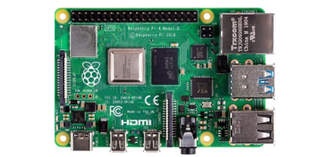
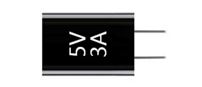

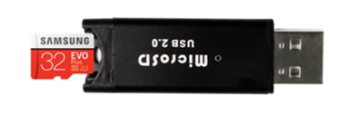
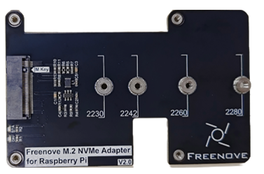
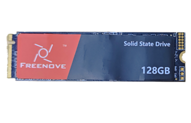

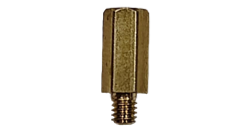
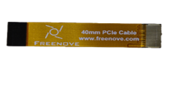

The Freenove M.2 NVMe Adapter for Raspberry Pi can be assembled either :ref`above <v2Assembling>` or **below** the Raspberry Pi 5. You can install it in the way you prefer.

Assembling above the Raspberry Pi 5
=========================================

+-----------------------------------------------------------------------------------------------------------------------------+
| 1. Connect the cable to Raspberry Pi 5.                                                                                     |
|                                                                                                                             |
| |Chapter02_47|                                                                                                              |
+-----------------------------------------------------------------------------------------------------------------------------+
| 2. :red:`Combine two M2.5x8+3 single-pass brass standoffs into a stacked pair`,prepare four such assemblies,                |
|                                                                                                                             |
| and install them onto each mounting holes **on the rear side** of the expansion board.                                      |
|                                                                                                                             |
| |Chapter02_48|                                                                                                              |
+-----------------------------------------------------------------------------------------------------------------------------+
| 3. Connect the other end of the cable to adapter board.                                                                     |
|                                                                                                                             |
| |Chapter02_49|                                                                                                              |
+-----------------------------------------------------------------------------------------------------------------------------+
| 4. Install the adapter board on top of the Raspberry Pi 5, and secure it from below the Raspberry Pi 5 using M2.5x3 screws. |
|                                                                                                                             |
| |Chapter02_50|                                                                                                              |
+-----------------------------------------------------------------------------------------------------------------------------+
| 5. Insert the SSD to the adapter board. **Please tilt it to insert.**                                                       |
|                                                                                                                             |
| |Chapter02_51|                                                                                                              |
+-----------------------------------------------------------------------------------------------------------------------------+
| 6. Fix the SSD with a M2.5 screw.                                                                                           |
|                                                                                                                             |
| |Chapter02_52|                                                                                                              |
+-----------------------------------------------------------------------------------------------------------------------------+

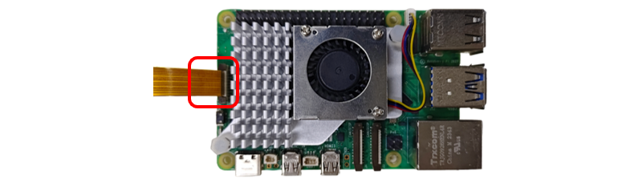
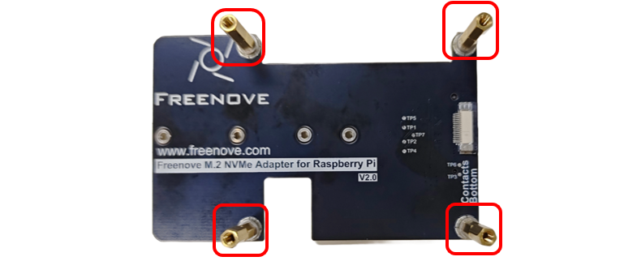
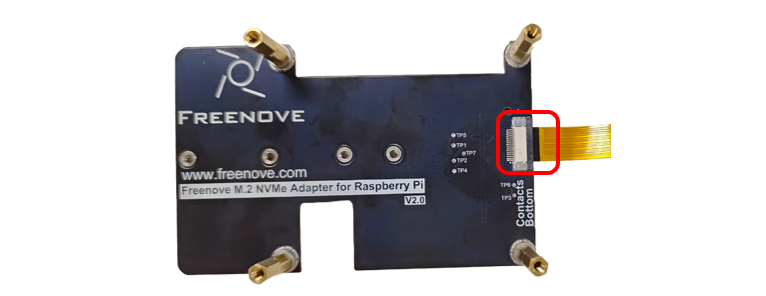
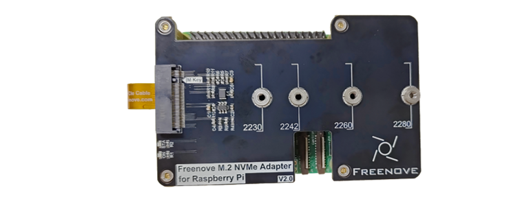
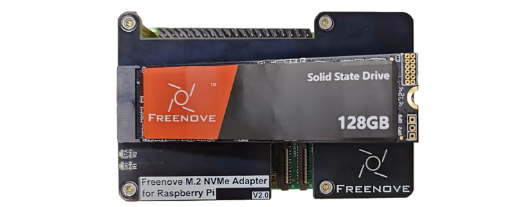
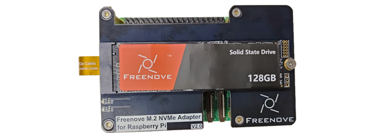

Assembling below the Raspberry Pi 5
==========================================

+------------------------------------------------------------------------------------------------------------------------+
| 1.  Connect the cable to Raspberry Pi 5.                                                                               |
|                                                                                                                        |
| |Chapter02_53|                                                                                                         |
+------------------------------------------------------------------------------------------------------------------------+
| 2. Insert the SSD to the adapter board. Please tilt it to insert.                                                      |
|                                                                                                                        |
| |Chapter02_54|                                                                                                         |
+------------------------------------------------------------------------------------------------------------------------+
| 3. Fix the SSD with a M2.5 screw.                                                                                      |
|                                                                                                                        |
| |Chapter02_55|                                                                                                         |
+------------------------------------------------------------------------------------------------------------------------+
| 4. Install one M2.5*8+3 single-pass brass standoffs onto each mounting holes on the front side of the adapter board.   |
|                                                                                                                        |
| |Chapter02_56|                                                                                                         |
+------------------------------------------------------------------------------------------------------------------------+
| 5. Assemble the adapter board below the Raspberry Pi 5, and secure it with M2.5x3 screws.                              |
|                                                                                                                        |
| |Chapter02_57|                                                                                                         |
+------------------------------------------------------------------------------------------------------------------------+
| 6. Connect the other end of the cable to the adapter board.                                                            |
|                                                                                                                        |
| |Chapter02_58|                                                                                                         |
+------------------------------------------------------------------------------------------------------------------------+

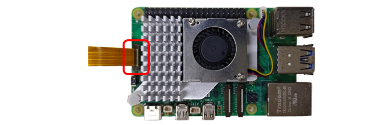
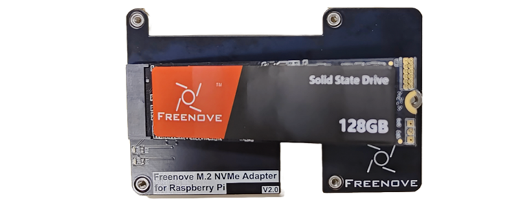
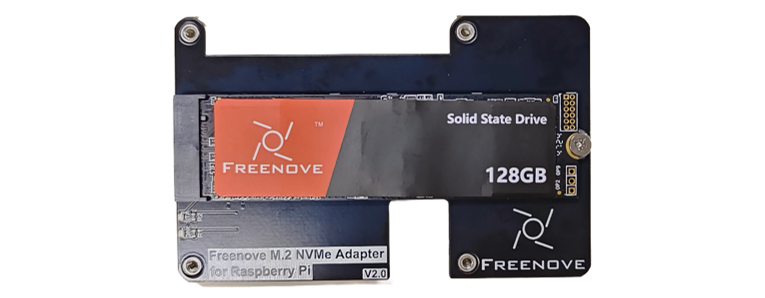
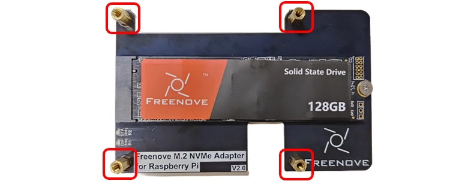
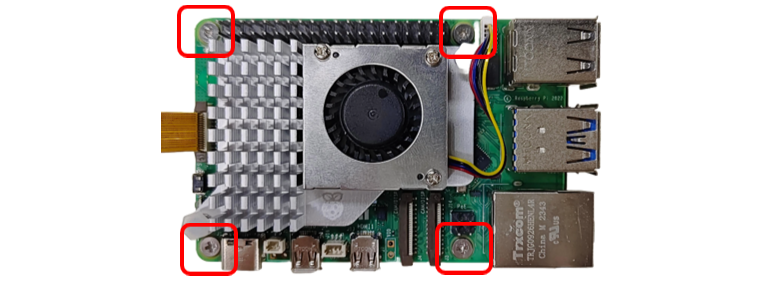
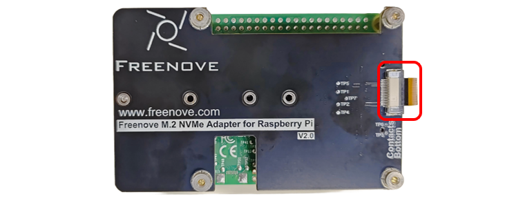

2.2 Flashing the RPi OS to NVME SSD
********************************************

Once everything is set up, power on the Raspberry Pi and boot into the system. (In this case, we are using a brand new SSD with a 512GBits capacity that has not been partitioned yet.)

2.2.1 SSD Detection
=========================================

:ref:`(Note: Not all SSDs are supported by Pi5.) <fnk0098/codes/v2/caution__incompatible_ssds:caution: incompatible ssds>`

Run the following command in the Terminal to check whether SSD is detected. 

**Note that different SSDs display different content.**

.. code-block:: console

    lspci

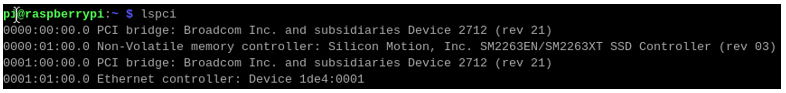

.. code-block:: console
    
    lsblk

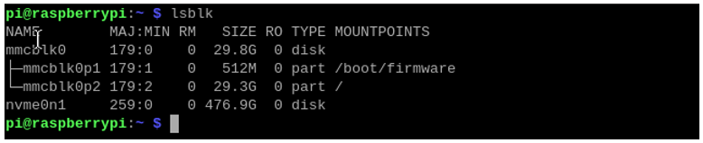

As shown in the figure above, the device 'nvme0n1' with a capacity of 476.9GBytes shows up, indicating that the SSD has been correctly recognized. The detected capacity will depend on the size of your SSD. If your drive has been previously partitioned, you may also see some partition information displayed.

.. note::
    
    Installing the system will format the SSD, erasing all data. If necessary, please back up any data on your SSD before proceeding.

2.2.2 Enable PCIE3.0 (on OS written into SD card)
===================================================

If the SSD you received is with **Phison** controller, you may need to enable PCIE 3.0. (This step is strongly recommended; without this step, the later process may fail.) 

If it is not with Phison controller, you do not need to enable PCIE 3.0. You may skip this section.

Run the command :guilabel:`lspci` to check the controller.

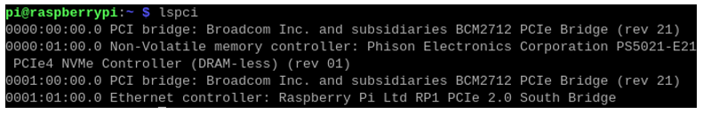

(The above screenshot is the result of a 128GB SSD with Phison as main controller.)

Enable PCIe Gen3.0
---------------------------------------------------

Add the line :guilabel:`dtparam=pciex1_gen=3` to /boot/firmware/config.txt to enable PCIe Gen3.0.

As shown below, enter the command to open the file.

.. code-block:: console
    
    sudo nano /boot/firmware/config.txt

Add the line :guilabel:`dtparam=pciex1_gen=3` to the end of the file, as shown below:

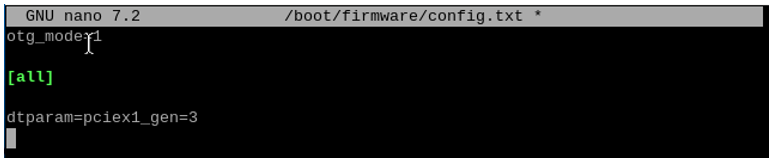

Press Ctrl-O to save the file, Enter to confirm, and Ctrl-X to exit.

Reboot your Raspberry Pi.

.. code-block:: console
    
    sudo reboot

2.2.3 SSD Partitioning and Formatting
---------------------------------------------------

**This step is not a must-do, but it can further test whether the SSD perform normally on Raspberry Pi** to ensure smooth performance in later steps.

At this point, the hard drive cannot be seen in the file manager, as the disk has not been partitioned yet.

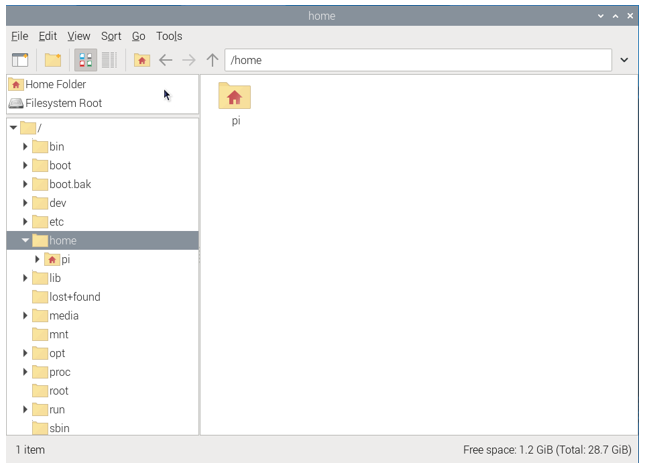

Install a disk management tool with the following command:

.. code-block:: console
    
    sudo apt-get install gparted

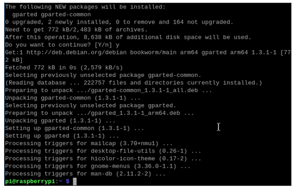

Open gparted with the command:

.. code-block:: console
    
    sudo gparted

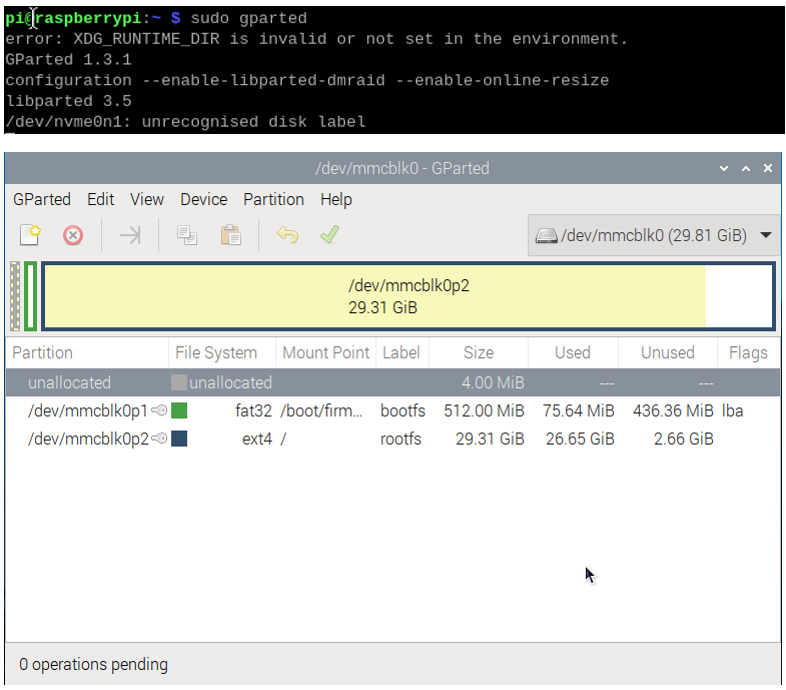

Click on the dropdown menu in the upper right corner and switch to NVME SSD.

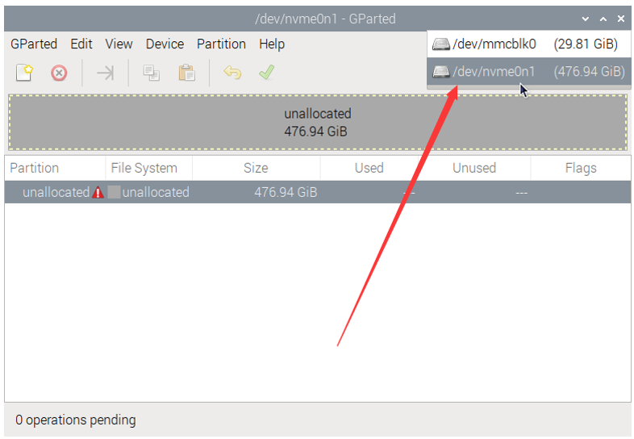

Click Device on the menu bar and select Create Partition Table.

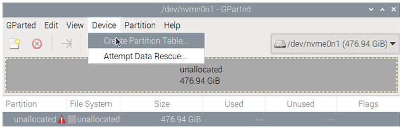

You will see the prompt that data will be erased. It is recommended to select gpt for partition table type. Click Apply.

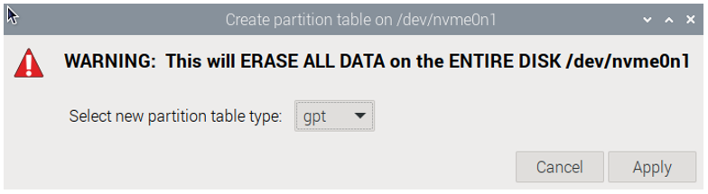

Click Partition on the menu bar, choose “New”.

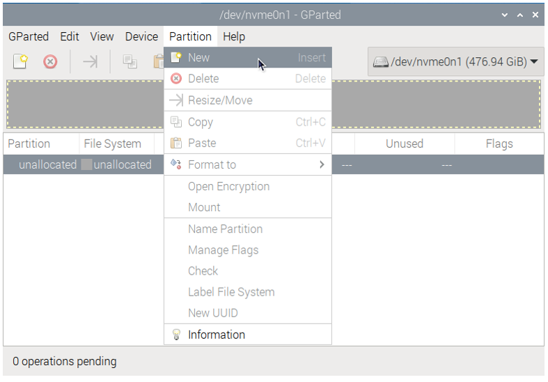

As shown in the figure below, the size of partition can be adjusted by dragging the mouse left and right, or by entering the size directly. The other options can be left as default setting. Here, we allocate all the capacity to a single partition. Click on Add.

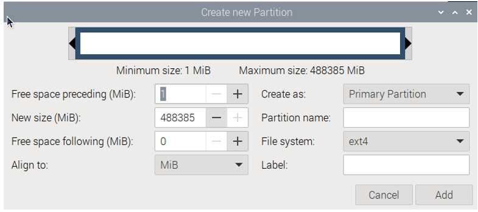

Click the check icon ✔ to save the partition just built, as illustrated below.

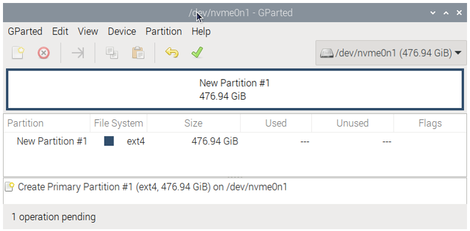

Click on Apply.

Wait for it to complete and click on Close.

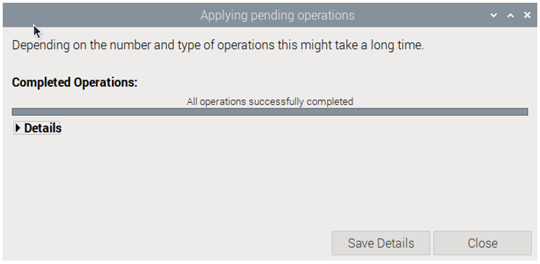

At this point, you can mount the disk using the mount command and then access the disk space through the file manager. Use the following command to mount the SSD:

.. code-block:: console
    
    mkdir pi
    sudo mount /dev/nvme0n1p1 /media/pi

Open the file manager, as shown below.

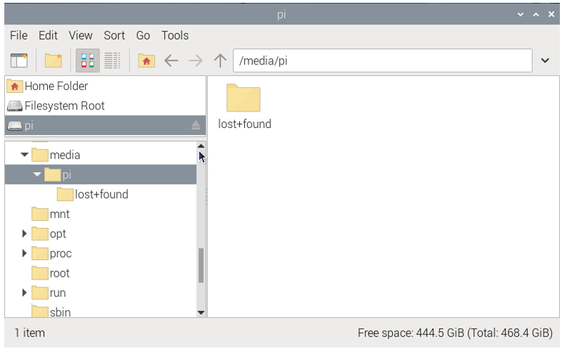

If you plan to use the SSD as a standard storage device, you can conclude the process here. However, if you want to further proceed with installing an operating system on the SSD, please read on.

2.2.4 Flashing the OS
--------------------------------

Install the OS to SSD with the method similar to that in the previous section on installing a system onto an SD card. This time, operate on the Raspberry Pi.

Install rpi-imager with the following command:

.. code-block:: console
    
    sudo apt install rpi-imager

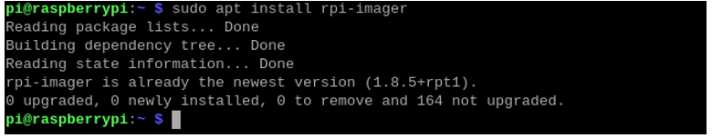

Open rpi-imager:

.. code-block:: console
    
    sudo rpi-imager

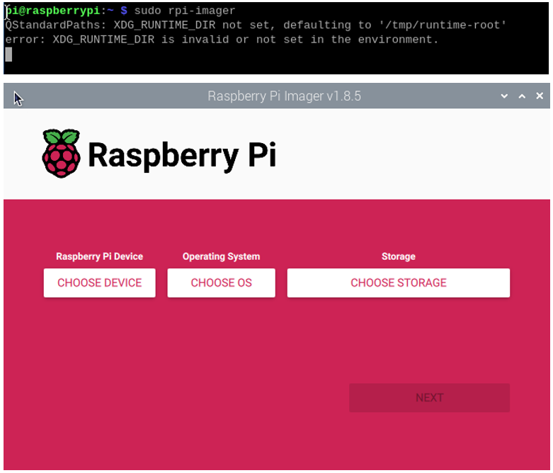

By this point, you should be quite familiar with the process.

Select the Raspberry Pi 5 as your device and choose either an online download or an offline file for the operating system; in this case, an offline file is selected. (It is recommended to use a 64-bit Raspberry Pi system with recommended software). Choose your NVME SSD as the storage device. Click NEXT.

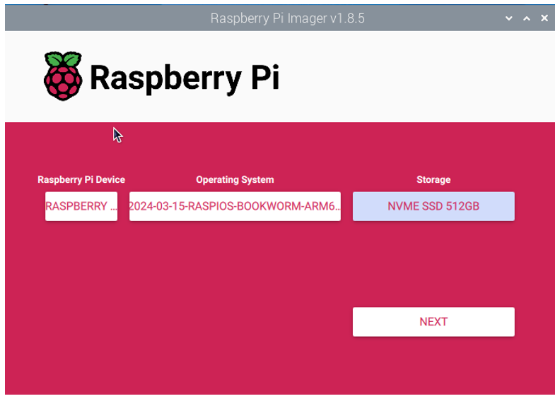

Click on EDIT SETTINGS.

Wireless LAN Country must be correctly set; otherwise, it may fail to search the WiFi. 

Enable SSH and click Save.

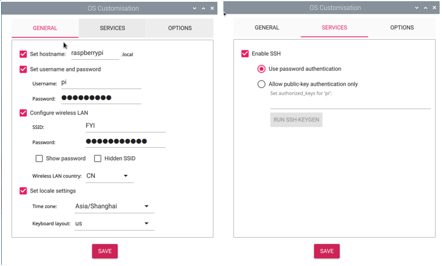

Click on YES.

Click on YES.

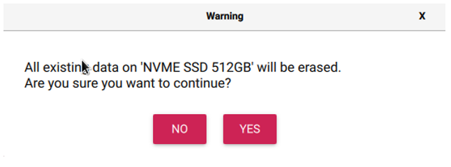

Wait for it to finish.

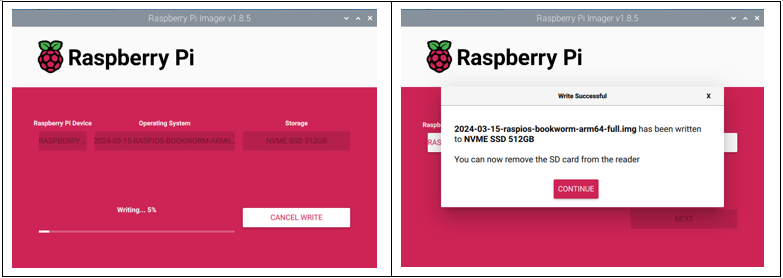

Congratulations! You have done the trickiest and the time-consuming part. Now that you have successfully installed the operating system onto the NVMe SSD, you are very close to achieving a triumph. 

Next, boot into the system from SSD.

2.2.5 Enable PCIE3.0 (on system written into SSD)
-------------------------------------------------------------------

If you have confirmed that SSD is with Phison controller in step 2, then you also need to enable PCIE3.0 on the system written into SSD.

If the controller of your SSD is not from Phison, you can skip this section.

The operation is as below:

1.	Run the command `lsblk` to check the partitions of the SSD with Raspberry Pi OS written, as shown below:

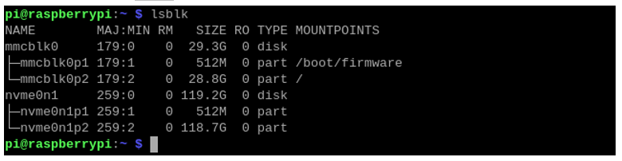

(The above screenshot is the result of a 128GB SSD with Phison as main controller.)

Run the following commands one by one to mount partition 1 of the SSD to the directory of /media/pi.

.. code-block:: console
    
    sudo mkdir /media/pi
    sudo mount /dev/nvme0n1p1 /media/pi

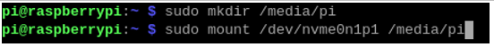

If it mounts successfully, you'll see the following disk icon on the desktop.

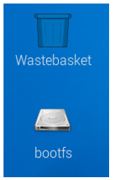

Open and modify the config.txt file with the following command.

.. code-block:: console
    
    sudo nano /media/pi/config.txt

Add the line :guilabel:`dtparam=pciex1_gen=3` to the end of the file, as shown below:

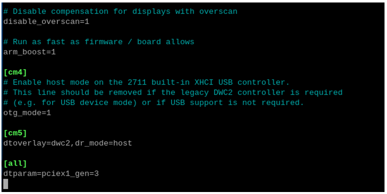

Press Ctrl-O to save the file, Enter to confirm, and Ctrl-X to exit.