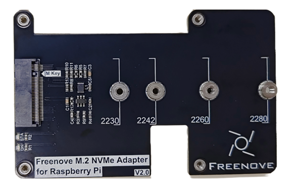

##############################################################################
Preface
##############################################################################

The Freenove M.2 NVMe Adapter for Raspberry Pi is a solid-state drives adapter designed specifically for the Raspberry Pi 5. Here are its key features:

* **Interface Type:** M.2 with M-Key

* **Supported Protocol:**  NVMe

* **Compatible Sizes:** 2230, 2242, 2260, 2280

* **Power Supply:** 3.3V, up to 3A (maximum)

* **Indicator Lights:** Includes both power and SSD status LEDs.

The Raspberry Pi 5 includes a PCIe x1 slot that is certified for PCIe Gen 2.0, providing a theoretical maximum throughput of 5GT/sec, which roughly translates to 500MB/sec for read and write operations. Although this slot is not officially certified for PCIe Gen 3.0, it is possible to force the use of Gen 3.0 for potentially higher speeds.

The PCIe consortium states that the speed of PCIe Gen 3.0 x1 is up to 8GT/sec, which translates to approximately 985MB/sec; however, Raspberry Pi claims that their implementation can achieve a speed of 10GT/sec, equivalent to around 1231MB/sec.

https://en.wikipedia.org/wiki/PCI_Express#Comparison_table

https://www.raspberrypi.com/documentation/computers/raspberry-pi.html#pcie-gen-3-0

SSDs generally provide significantly faster read and write speeds compared to SD cards and USB drives, which can notably elevate the user experience when operating the Raspberry Pi 5.

Welcome to the Freenove M.2 NVMe Adapter for Raspberry Pi. This guide will walk you through the steps to effectively integrate and utilize this adapter on your Raspberry Pi 5.

Additionally, if you encounter any issues or have questions about this tutorial or the contents of kit, you can always contact us for free technical support at:

support@freenove.com